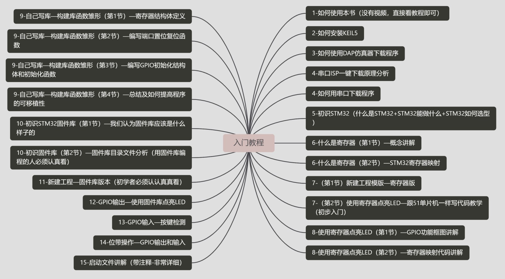

<!--
 * @Author: your name
 * @Date: 2021-06-14 23:45:16
 * @LastEditTime: 2021-06-15 00:28:20
 * @LastEditors: your name
 * @Description: 
 * @FilePath: \003_GitProject\Stm32_Hugh_Notes\01Course_GettingStarted\README.md
 * 可以输入预定的版权声明、个性签名、空行等
-->
## 入门教程的思维导图
