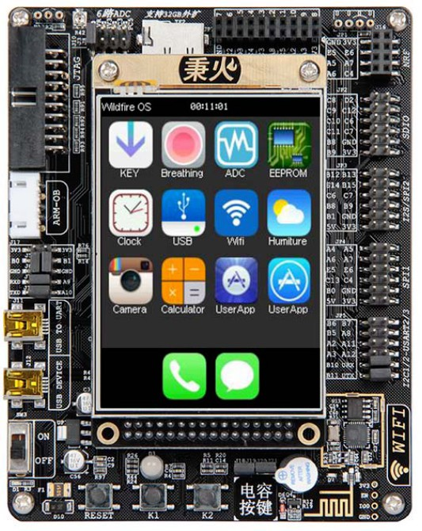

<!--
 * @Author: your name
 * @Date: 2021-06-14 23:45:16
 * @LastEditTime: 2021-06-15 00:31:55
 * @LastEditors: your name
 * @Description: 
 * @FilePath: \003_GitProject\Stm32_Hugh_Notes\README.md
 * 可以输入预定的版权声明、个性签名、空行等
-->
# Stm32_Hugh_Notes
## Stm32简介
以下的学习笔记配套的硬件平台为：野火STM32-F103VE-指南者，型号简称“指南者”。

## 项目文件说明
**入门教程**文件夹名称为`01Course_GettingStarted`；
**中级教程**文件夹名称为`02Course_Intermediate`；
**提高教程**文件夹名称为`03Course_Improve`；
**大师教程**文件夹名称为`04Course_Grandmaster`；